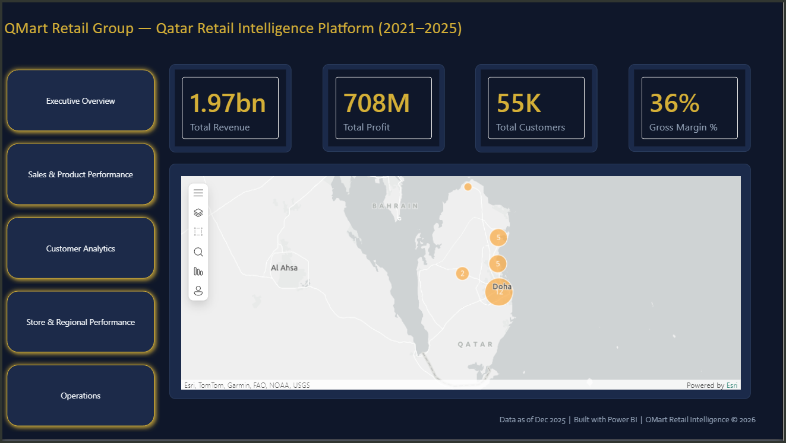
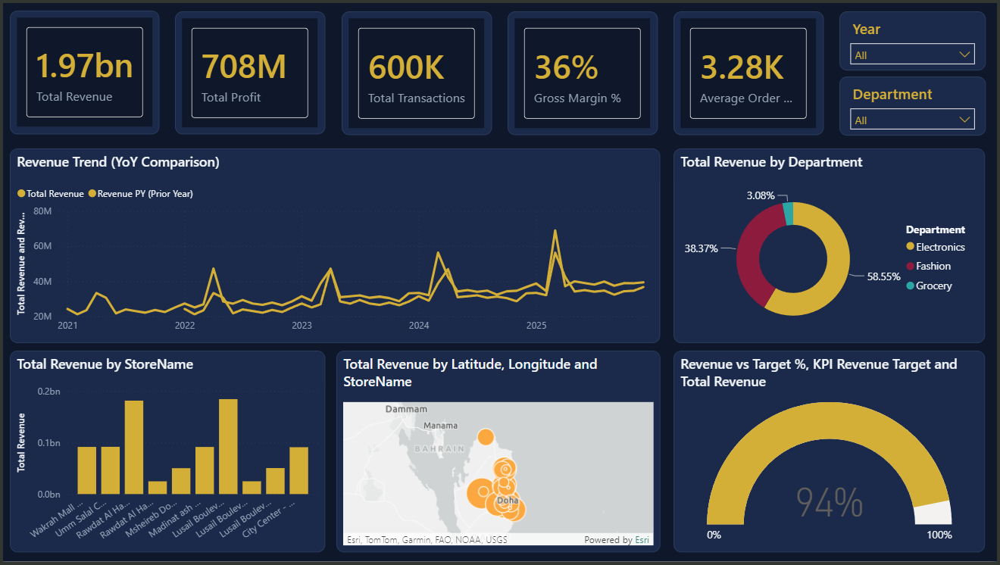
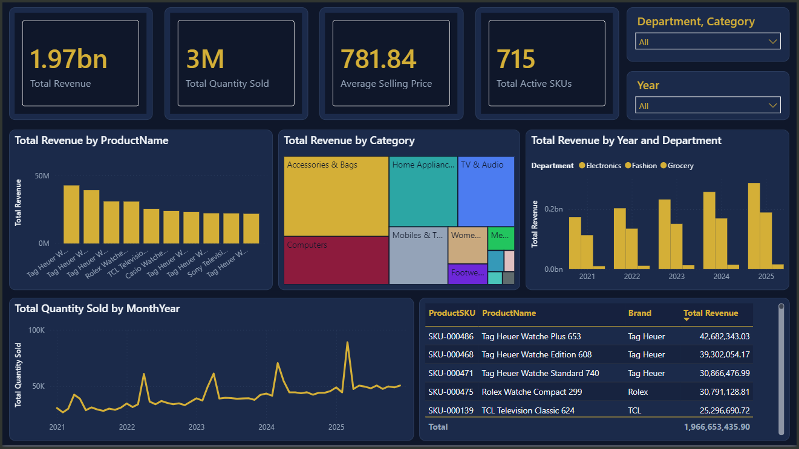
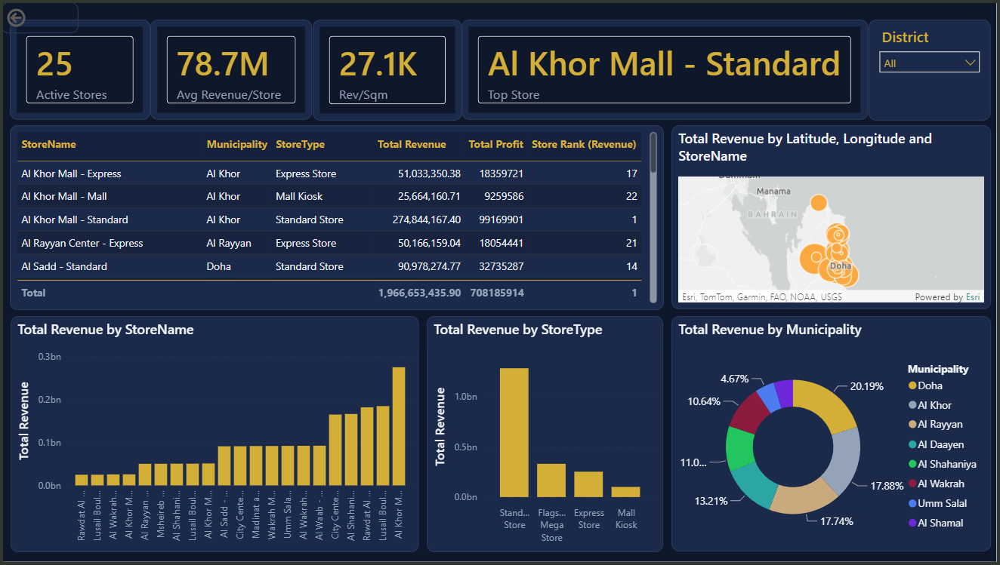
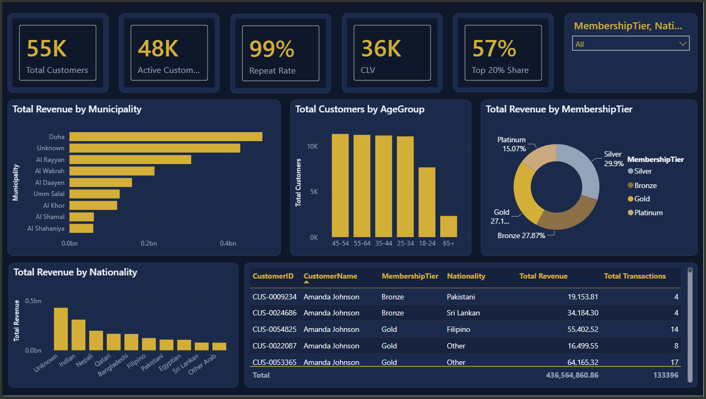
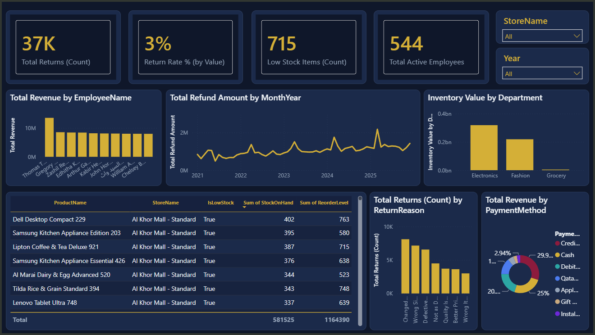

# QMart Retail Intelligence — Qatar Retail BI Platform (2021–2025)

An end-to-end Power BI solution built for a multi-store retail group operating across Qatar, covering executive performance, sales, store operations, customer behavior, and inventory/operations analytics in a single connected data model.

**Tools:** Power BI · DAX · Power Query · Star Schema Data Modeling

---

## 🧭 Navigation / Home

The landing page gives a one-glance summary of the whole business and lets stakeholders jump into any of the five analysis areas.



- **1.97bn** Total Revenue · **708M** Total Profit · **55K** Total Customers · **36%** Gross Margin
- Interactive map of store locations across Qatar (Doha, Al Khor, Al Rayyan, and surrounding municipalities)

---

## 1️⃣ Executive Overview

High-level KPIs and trends for leadership — built to answer "how is the business doing" in under 10 seconds.



- **1.97bn** Total Revenue · **708M** Total Profit · **600K** Total Transactions · **36%** Gross Margin · **3.28K** Average Order Value
- Year-over-year revenue trend comparison
- Revenue breakdown by department (Electronics, Fashion, Grocery)
- Revenue by store and geographic distribution
- Revenue vs. Target KPI gauge (currently tracking at 94% of target)

---

## 2️⃣ Sales & Product Performance

Product-level performance for merchandising and category management decisions.



- **1.97bn** Total Revenue · **3M** Units Sold · **781.84** Average Selling Price · **715** Active SKUs
- Top-performing products and brands (e.g., Tag Heuer, Rolex, TCL)
- Revenue by category treemap (Accessories & Bags, Home Appliances, TV & Audio, Computers, Mobiles, Fashion)
- Revenue by year and department
- Monthly quantity-sold trend with seasonal spikes

---

## 3️⃣ Store & Regional Performance

Store-level and regional benchmarking to identify top and underperforming locations.



- **25** Active Stores · **78.7M** Average Revenue per Store · **27.1K** Revenue per Sqm
- Store ranking table by revenue, profit, and rank
- Revenue by store type (Standard, Express, Mall Kiosk, Flagship Mega Store)
- Revenue distribution by municipality (Doha, Al Khor, Al Rayyan, Al Wakrah, and others)
- Geographic map of store performance

---

## 4️⃣ Customer Analytics

Customer segmentation and loyalty insights to support retention and targeting strategy.



- **55K** Total Customers · **48K** Active Customers · **99%** Repeat Rate · **36K** Customer Lifetime Value (CLV) · **57%** Revenue Share from Top 20% of Customers
- Revenue by municipality and nationality
- Customer distribution by age group
- Revenue by membership tier (Silver, Bronze, Gold, Platinum)
- Customer-level drill-through table with transaction history

---

## 5️⃣ Operations

Operational health monitoring covering returns, inventory, and workforce.



- **37K** Total Returns · **3%** Return Rate (by Value) · **715** Low-Stock Items · **544** Active Employees
- Revenue by employee (top performer leaderboard)
- Monthly refund amount trend
- Inventory value by department
- Return reasons breakdown and low-stock product alerts
- Revenue by payment method

---

## 📁 Repository Structure

```
qmart-retail-intelligence/
├── README.md
├── QMart_Retail_Intelligence.pbix
└── screenshots/
    ├── 00_Home.png
    ├── 01_Executive_Overview.png
    ├── 02_Sales_Product_Performance.png
    ├── 03_Store_Regional_Performance.png
    ├── 04_Customer_Analytics.png
    └── 05_Operations.png
```
